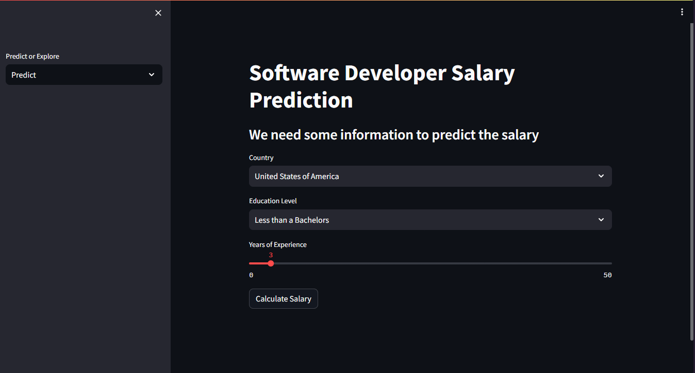

# Software Developer Salary Prediction Web App With Streamlit
 - In this project I have used the 2023 Developer Survey from Stack Overflow to predict the salary of a developer found in 17 countries.

  

## DEMO
 - You can check the live demo [here](https://8502-01hwj8ynshjz7spkr595x77ec2.cloudspaces.litng.ai)

## Data Description
 - I have used the 'cleaned_data.csv' file for the project after cleaning and manipulating the original survey [file](https://cdn.stackoverflow.co/files/jo7n4k8s/production/49915bfd46d0902c3564fd9a06b509d08a20488c.zip/stack-overflow-developer-survey-2023.zip)
 - I have used three features to predict the salary namely:
  1. Country
  2. Education Level
  3. Years of Experience

## Model Description
 - The model I have used is RandomForestRegressor, you can check the model's training process in the `salary-prediction.ipynb` notebook found in the `app` directory
 - The model's score was 0.567083(56%)

## Libraries Used
 - Numpy
 - Pandas
 - Matplotlib
 - Scikit-learn
 - Streamlit

## Installation
 1. Prerequisites
    - Git
    - Command line familiarity
 2. Clone the Repository: `git clone https://github.com/NebeyouMusie/Software-Developer-Salary-Prediction-Web-App-With-Streamlit.git`
 3. Create and Activate Virtual Environment (Recommended)
    - `python -m venv venv`
    - `source venv/bin/activate`
 4. Navigate to the projects directory `cd ./Software-Developer-Salary-Prediction-Web-App-With-Streamlit` using your terminal
 4. Install Libraries: `pip install -r requirements.txt`
 5. Navigate to the `app` directory(`cd ./app`) then run `streamlit run app.py`
 6. Open the link displayed in the terminal on your browser
 7. `Predict` salary by providing all the values for the input fields specified
 8. Choose the `Explore` option on the sidebar to have a look at some visualizations of the data

## Acknowledgments
 - I would like to thank [Patrick Loeber](https://youtube.com/@patloeber?si=86RM0KTMIfti8xiV)
   
## Contact
 - LinkedIn: [Nebeyou Musie](https://www.linkedin.com/in/nebeyou-musie)
 - Gmail: nebeyoumusie@gmail.com
 - Telegram: [Nebeyou Musie](https://t.me/NebeyouMusie)
    
